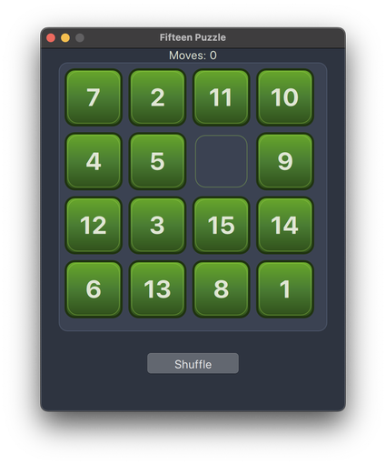

# Fifteen


[](https://github.com/VioletSoul/Fifteen)
[](https://github.com/VioletSoul/Fifteen/commits/main)

A classic "Game of Fifteen" (15 puzzle) implemented with PyQt6 and QML.

## Features

- **Modern UI:** Clean and visually appealing interface built with QML.
- **Correct Game Logic:** Proper shuffling, move validation, and win detection.
- **Move Counter:** Tracks the number of moves made in the current game.
- **Win Notification:** Modal dialog appears when you solve the puzzle.
- **Cross-platform:** Works on Windows, Linux, and macOS (with PyQt6 and QML support).

## Requirements

- Python 3.9+
- [PyQt6](https://pypi.org/project/PyQt6/)

## Installation

1. **Clone the repository:**
```
git clone https://github.com/VioletSoul/Fifteen.git
cd Fifteen
```
2. **Install dependencies:**
```
pip install PyQt6
```

## Usage

1. **Run the game:**
```
python main.py
```
2. **How to play:**
- Click on a tile adjacent to the empty space to move it.
- Click "Shuffle" to start a new game.
- Arrange the tiles in order from 1 to 15 with the empty space at the end.
- The move counter below the Shuffle button shows your current number of moves.

## File Structure

- `main.py` — Main game logic and Qt application setup (run this file to start the game).
- `main.qml` — QML UI definition and layout.
- `15.png` — Application window icon.
- `README.md` — This file.

## Screenshot



## License

MIT

---

**Enjoy playing the Game of Fifteen!**

[GitHub Repository](https://github.com/VioletSoul/Fifteen)
